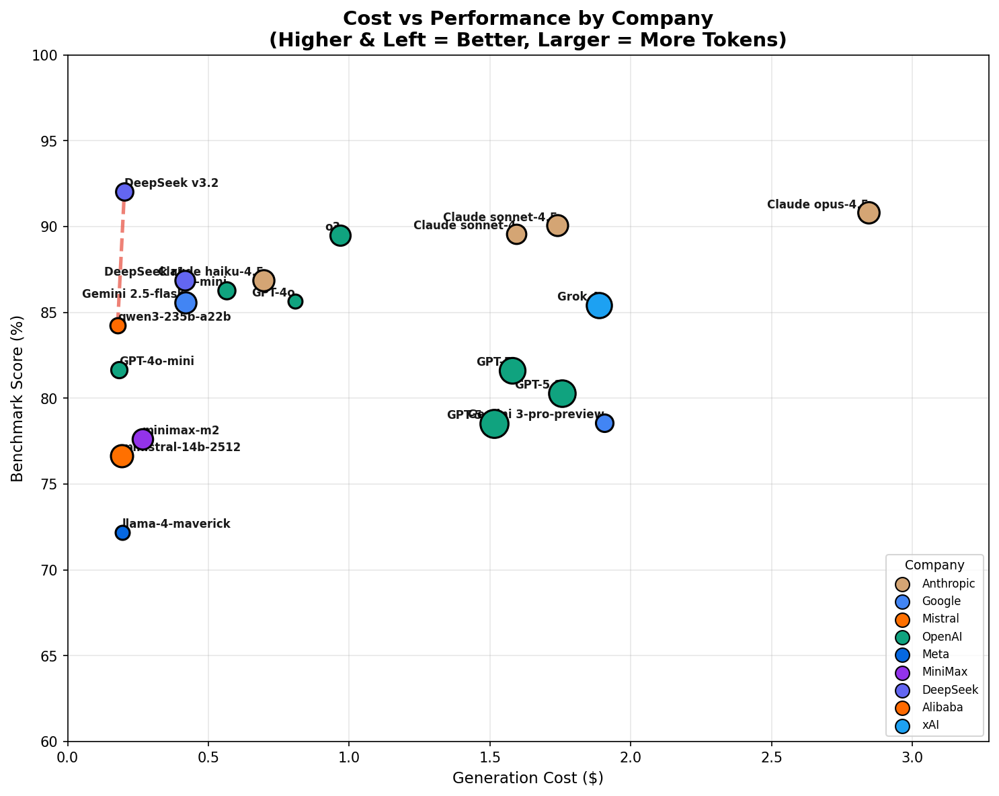
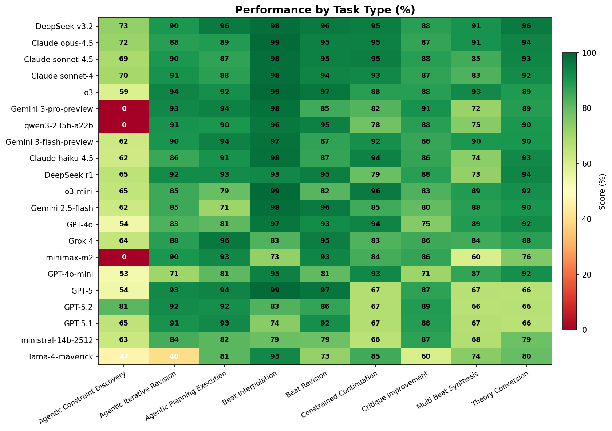
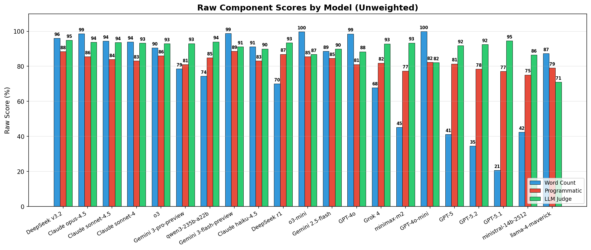
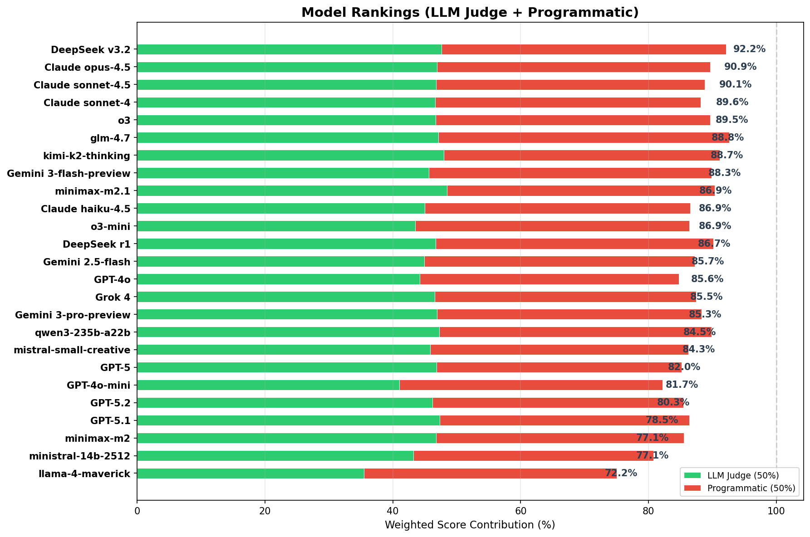

# 📖 Story Theory Benchmark

A **rigorous, reproducible benchmark** for evaluating LLM narrative generation capabilities across mainstream story theory frameworks. **Hard to solve, easy to verify.**

> **34 diverse tasks** × **25 frontier models** × **3 evaluators** = Comprehensive narrative AI evaluation

## 🎯 Why Story Theory?

Current LLM benchmarks test pattern matching and memorization. Story Theory Benchmark tests **deep structural understanding** of narrative:

- **Understanding**: Can models apply complex narrative theory frameworks?
- **Execution**: Can they correctly implement story beats?
- **Planning**: Can they coordinate multi-beat constraints?
- **Revision**: Can they improve through feedback?
- **Conversion**: Can they map between different frameworks?

Traditional story theories (Hero's Journey, Save the Cat, etc.) are **objective, falsifiable, and widely understood**—perfect for rigorous evaluation.

---

## 📊 Quick Results

### Model Rankings



| Rank | Model | Score | Cost | Value |
|------|-------|-------|------|-------|
| 🥇 | **DeepSeek v3.2** | **91.9%** | $0.20 | 426.9 |
| 🥈 | Claude Opus 4.5 | 90.8% | $2.85 | 29.0 |
| 🥉 | Claude Sonnet 4.5 | 90.1% | $1.74 | 46.6 |
| 4 | Claude Sonnet 4 | 89.6% | $1.59 | 50.4 |
| 5 | o3 | 89.3% | $0.96 | 83.2 |

**Full leaderboard**: See [LEADERBOARD.md](results/LEADERBOARD.md)

### Performance by Task Type



**Standard Tasks:**
- **Best in Beat Interpolation**: o3-mini (99.2%)
- **Best in Beat Revision**: GPT-5 (97.2%)
- **Best in Multi-Beat Synthesis**: o3 (92.9%) — Tests long-range planning
- **Best in Constrained Continuation**: o3-mini (95.8%)
- **Best in Theory Conversion**: DeepSeek v3.2 (95.8%)

**Agentic Tasks:**
- **Best in Constraint Discovery**: GPT-5.2 (81.4%) — Strategic questioning
- **Best in Planning Execution**: Grok 4 (96.4%) — Plan-then-execute
- **Best in Iterative Revision**: o3 (93.9%) — Rule-based feedback
- **Best in Critique Improvement**: GPT-5.2 (88.8%) — LLM critic feedback

---

## 🧩 Benchmark Design

### 9 Task Types (34 Tasks Total)

#### Standard Tasks (Single-shot Generation)

| Task | Count | Challenge | Difficulty |
|------|-------|-----------|------------|
| **Beat Interpolation** | 5 | Generate missing beat A→B→C | Medium |
| **Beat Revision** | 5 | Identify and fix incorrect beat | Medium-Hard |
| **Constrained Continuation** | 4 | Write with 8-10 simultaneous constraints | Hard |
| **Theory Conversion** | 4 | Rewrite Story A → Story B framework | Hard |
| **Multi-Beat Synthesis** | 3 | Write 3 beats with cross-beat dependencies | Very Hard |

#### Agentic Tasks (Multi-turn)

| Task | Count | Challenge | Key Metric |
|------|-------|-----------|------------|
| **Constraint Discovery** | 3 | Ask YES/NO questions to find hidden rules | Discovery efficiency |
| **Planning Execution** | 3 | Plan first, then execute | Plan adherence |
| **Iterative Revision** | 3 | Improve through rule-based feedback | Improvement trajectory |
| **Critique Improvement** | 4 | Improve through LLM critic feedback | Score progression |

### Story Theories Covered

✓ **Hero's Journey** (12 beats) — Joseph Campbell
✓ **Save the Cat** (15 beats) — Blake Snyder
✓ **Story Circle** (8 beats) — Dan Harmon
✓ **Freytag's Pyramid** (5 stages) — Gustav Freytag
✓ **Three-Act Structure** (3 acts) — Aristotle/Syd Field

### Scoring System

**Two-component 50/50 split:**

- **Programmatic (50%)**: Word count + repetition + coherence
- **LLM Judge (50%)**: Task-specific narrative criteria

Results are **median aggregated across 3 evaluator models**:
- Claude Haiku 4.5
- Gemini 2.5-Flash
- GPT-5-Mini

---

## 🔬 Benchmark Results

### Component Breakdown



### Rankings Visualization



### Key Findings

1. **Cost-Effectiveness Winner**: DeepSeek v3.2
   - 91.9% score at $0.20 generation cost
   - ~427× value score (Score²/Cost ratio)

2. **Quality Leaders**: Anthropic models excel across most tasks
   - Claude Opus 4.5: 90.8% (consistent across all tasks)
   - Claude Sonnet 4.5: 90.1% (best value for premium quality)

3. **Agentic Tasks Reveal New Gaps**:
   - **Constraint Discovery**: Hardest task type (avg 63%)
   - **Planning Execution**: Grok 4 excels (96.4%)
   - **Iterative Revision**: o3 dominates (93.9%)

4. **Task Type Insights**:
   - Multi-beat synthesis shows clear capability gaps
   - Constrained continuation tests multi-constraint planning
   - Beat interpolation has near-ceiling performance for top models
   - Agentic tasks discriminate 2-3× better than single-shot

---

## 📈 Dataset & Evaluation Scale

| Metric | Value |
|--------|-------|
| Total tasks | 34 (21 standard + 13 agentic) |
| Generation runs | 850 (25 models × 34 tasks) |
| Evaluations | 2,553 (3 evaluators each, 100% complete) |
| **Total cost** | $41.73 |

---

## 🚀 Getting Started

### Installation

```bash
git clone https://github.com/clchinkc/story-bench.git
cd story-bench

pip install -r requirements.txt
cp .env.example .env
# Edit .env with your OpenRouter API key
```

### Quick Commands

```bash
# Check benchmark status
python run.py --status

# Run benchmark for a model
python run.py --gen-model "anthropic/claude-sonnet-4"

# Run specific task type
python run.py --gen-model "anthropic/claude-sonnet-4" --task-type "multi_beat_synthesis"

# Generate leaderboard
python run.py --leaderboard

# Visualize results
python visualize.py

# See full CLI options
python run.py --help
```

### Run Specific Tasks

```bash
# All agentic tasks
python run.py --gen-model "openai/gpt-4o" --task-type "agentic_constraint_discovery"

# Standard narrative tasks only
python run.py --gen-model "anthropic/claude-opus-4.5" --task-type "beat_interpolation"

# With specific evaluators
python run.py --gen-model "anthropic/claude-sonnet-4.5" \
  --eval-model "anthropic/claude-haiku-4.5" "openai/gpt-4o"
```

### Python API

```python
import sys
sys.path.insert(0, 'src')

from results_db import ResultsDatabase
from utils import load_all_tasks

# Get benchmark status
db = ResultsDatabase()
db.print_status()

# Get leaderboard
print(db.generate_leaderboard_md())

# Get missing work
tasks = load_all_tasks()
missing = db.get_missing_generations(
    task_ids=[t["task_id"] for t in tasks],
    models=["anthropic/claude-opus-4.5"],
    samples=1
)
print(f"Missing: {len(missing)} generations")
```

---

## 📁 Repository Structure

```
story-bench/
├── run.py                           # CLI entry point
├── visualize.py                     # Visualization dashboard
├── dataset/
│   ├── tasks/                       # 34 task YAML files
│   │   ├── beat_interpolation/      # 5 tasks
│   │   ├── beat_revision/           # 5 tasks
│   │   ├── multi_beat_synthesis/    # 3 tasks
│   │   ├── agentic_*/              # 10 agentic tasks
│   │   └── ...
│   └── schemas/
│       ├── task_schema.json
│       └── evaluation_schema.json
├── src/
│   ├── generator.py                 # Story generation
│   ├── evaluator.py                 # LLM-as-judge
│   ├── agentic_generator.py         # Multi-turn generation
│   ├── results_db.py                # Results persistence
│   └── utils.py                     # Shared utilities
├── results/
│   ├── LEADERBOARD.md               # Full rankings
│   ├── TASK_ANALYSIS.md             # Task-level breakdown
│   ├── benchmark_results.json       # Database
│   └── visualizations/              # PNG charts
├── config/
│   ├── models.yaml                  # Model configs
│   └── settings.yaml                # Benchmark settings
└── CLAUDE.md                        # Detailed documentation
```

---

## 🏆 How to Interpret Results

### Score Components

Each model gets evaluated on:
1. **Programmatic checks** (50% weight):
   - Word count appropriate?
   - Repetition under control?
   - Coherence maintained?

2. **LLM Judge evaluation** (50% weight):
   - Task-specific narrative criteria
   - Beat definitions satisfied?
   - Constraints respected?
   - Character consistency?

### Value Metric

**Value = Score² / Cost**

This quadratically rewards quality while penalizing cost. A model at 90% is 2.47× more valuable than one at 70%, even if only 28% more expensive.

### Discriminative Power

Tasks with high score spreads (difference between best/worst model) are more useful for differentiating capabilities:

- ✅ **Most discriminative**: Iterative Revision (90% spread)
- ✅ **High discrimination**: Multi-Beat Synthesis (63% spread)
- ⚠️ **Medium discrimination**: Beat Interpolation (36% spread)
- ⚠️ **Low discrimination**: Theory Conversion (31% spread) — near ceiling

---

## 🔍 Key Findings from Analysis

### Model Tiers

**Tier 1 - Frontier ($0-1.50/1M tokens)**
- DeepSeek v3.2: Best value leader
- Claude models: Consistent quality
- o3/o3-mini: Strong all-around

**Tier 2 - Mid-range ($0.15-0.50/1M tokens)**
- GPT-4o, Gemini 2.5-Flash: Solid performance
- DeepSeek R1: Good value

**Tier 3 - Budget-Efficient (<$0.20/1M tokens)**
- Qwen, Ministral, Llama: Cost leaders but lower scores

### Task Insights

1. **Beat Interpolation** (91.6% avg): Most models excel here
   - Tests beat execution and context understanding
   - Good baseline task

2. **Multi-Beat Synthesis** (78.1% avg): Significant spread
   - **Best discriminator** for model planning abilities
   - Requires coordinating 3 beats with cross-constraints

3. **Constraint Discovery** (63.7% avg): Hardest agentic task
   - Tests strategic questioning
   - Huge ceiling: best score 95%, worst 34%

4. **Beat Revision** (90% avg): Consistent performance
   - One task (revision_005) is an outlier — much harder
   - Tests error identification

### Cost-Effectiveness Tiers

| Category | Model | Score | Cost | Value |
|----------|-------|-------|------|-------|
| Best Quality | Claude Opus 4.5 | 90.8% | $2.85 | 29.0 |
| Best Overall | DeepSeek v3.2 | 91.9% | $0.20 | 426.9 |
| Best Value | Qwen3-235b | 83.4% | $0.18 | 392.9 |
| Best Budget | GPT-4o-mini | 81.7% | $0.18 | 364.7 |

---

## 📋 Citation

If you use Story Theory Benchmark in your research, please cite:

```bibtex
@software{story_theory_benchmark_2024,
  title = {Story Theory Benchmark: Narrative Generation Evaluation Framework},
  author = {firstoryapp},
  year = {2024},
  url = {https://github.com/clchinkc/story-bench},
  note = {34 tasks across 9 task types, 25 models evaluated}
}
```

---

## 📖 Documentation

- **[CLAUDE.md](CLAUDE.md)** - Detailed project documentation
- **[LEADERBOARD.md](results/LEADERBOARD.md)** - Full rankings and scores
- **[TASK_ANALYSIS.md](results/TASK_ANALYSIS.md)** - Task-level breakdown

---

## 🤝 Contributing

We welcome contributions! Please:

1. Fork the repository
2. Create a feature branch
3. Add new tasks following `dataset/schemas/task_schema.json`
4. Submit a pull request

### Adding a New Task

1. Create a task YAML in `dataset/tasks/{task_type}/task_NNN.yaml`
2. Validate against schema: `python -m jsonschema ...`
3. Test with one model: `python run.py --task-id task_001 --gen-model ...`
4. Submit PR

---

## ⚖️ License

MIT License — see [LICENSE](LICENSE) for details

---

## 🙏 Acknowledgments

- Story theory frameworks by Joseph Campbell, Blake Snyder, Dan Harmon, Gustav Freytag, Aristotle
- OpenRouter API for model access
- Inspired by evaluation frameworks like HELM, BIG-bench, and MMLU

---

## 📞 Questions?

- 💬 Open an issue on GitHub
- 🐦 Twitter: [@firstoryapp](https://twitter.com/firstoryapp)
- 🔗 Read the full docs in [CLAUDE.md](CLAUDE.md)

---

**Made with 📖 for story lovers and LLM researchers.**

*Last updated: 2025-12-24*
